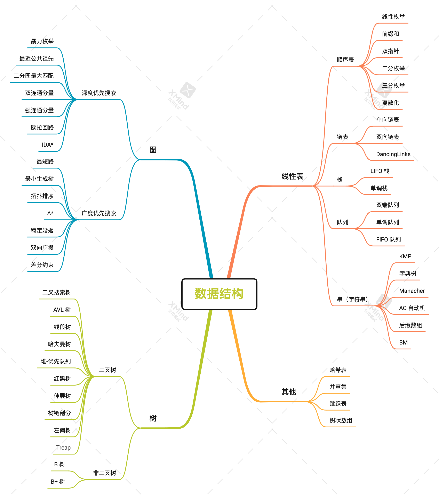
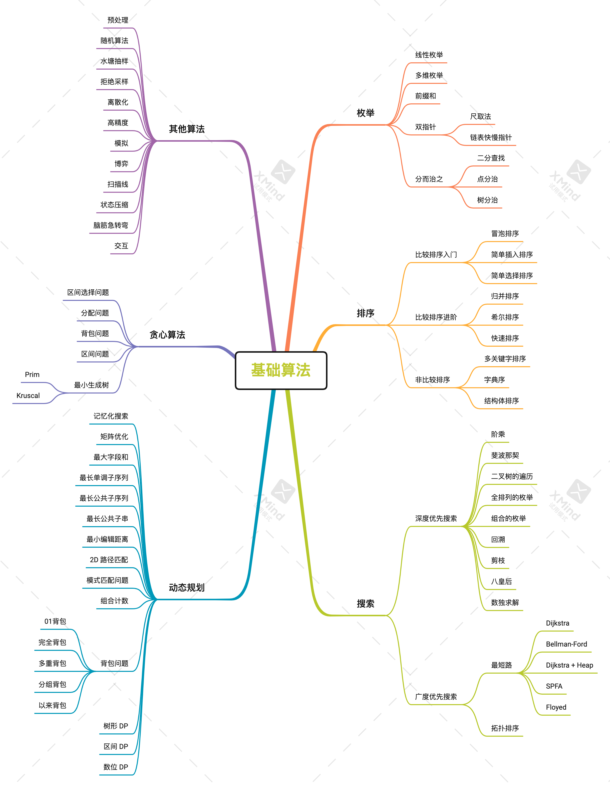

# data_structure

[TOC]

## 线性表

### 顺序表

- 线性枚举
- 前缀和
- 双指针
- 二分枚举
- 三分枚举
- 离散化

### 链表

- 单向链表
- 双向链表
- DancingLinks

### 栈

- LIFO 栈
- 单调栈

### 队列

- 双端队列
- 单调队列
- FIFO 队列

### 串（字符串）

- KMP
- 字典树
- Manacher
- AC 自动机
- 后缀数组
- BM

## 图

### 深度优先搜索

- 暴力枚举
- 最近公共祖先
- 二分图最大匹配
- 双连通分量
- 强连通分量
- 欧拉回路
- IDA*

### 广度优先搜索

- 最短路
- 最小生成树
- 拓扑排序
- A*
- 稳定婚姻
- 双向广搜
- 差分约束

## 树

### 二叉树

- 二叉搜索树
- AVL 树
- 线段树
- 哈夫曼树
- 堆-优先队列
- 红黑树
- 伸展树
- 树链剖分
- 左偏树
- Treap

### 非二叉树

- B 树
- B+ 树

## 其他

### 哈希表

### 并查集

### 跳跃表

### 树状数组

# algorithm

## 枚举

### 	线性枚举

### 	多维枚举

### 	前缀和

### 	双指针

​		尺取法
​		链表快慢指针

### 	分而治之

​		二分查找
​		点分治
​		树分治

## 排序

### 	比较排序入门

​		冒泡排序
​		简单插入排序
​		简单选择排序

### 	比较排序进阶

​		归并排序
​		希尔排序
​		快速排序

### 	非比较排序

​		多关键字排序
​		字典序
​		结构体排序

### 贪心算法

​	区间选择问题
​	分配问题
​	背包问题
​	区间问题
​	最小生成树
​		Prim
​		Kruscal

## 搜索

### 	深度优先搜索

​		阶乘
​		斐波那契
​		二叉树的遍历
​		全排列的枚举
​		组合的枚举
​		回溯
​		剪枝
​		八皇后
​		数独求解

### 	广度优先搜索

​		最短路
​			Dijkstra
​			Bellman-Ford
​			Dijkstra + Heap
​			SPFA
​			Floyed
​		拓扑排序

## 动态规划

​	记忆化搜索
​	矩阵优化
​	最大字段和
​	最长单调子序列
​	最长公共子序列
​	最长公共子串
​	最小编辑距离
​	2D 路径匹配
​	模式匹配问题
​	组合计数
​	背包问题
​		01背包
​		完全背包
​		多重背包
​		分组背包
​		以来背包
​	树形 DP
​	区间 DP
​	数位 DP

## 其他算法

​	预处理
​	随机算法
​	水塘抽样
​	拒绝采样
​	离散化
​	高精度
​	模拟
​	博弈
​	扫描线
​	状态压缩
​	脑筋急转弯
​	交互

